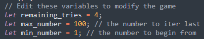

# Oakchris1955's simple guessing game
A command-line based guessing game. Both installation and configuration are pretty straightforward

## Installation
### Compiling from source
To begin with:
1) Install Rust from the [Official Rust website](https://www.rust-lang.org/tools/install)
2) Install Git from the [Git website](https://git-scm.com/downloads)
3) Open shell or command prompt and `cd` to the directory you wanna install the program
4) Type `git clone https://github.com/Oakchris1955/rust-guessing-game.git` and `cd rust-guessing-game`
5) Then, all you have to do is run `compile.sh` for Linux or `compile.bat` for Windows, which will generate an executable on the main directory of the cloned repository (Note: Remove the `--release` flag from the `compile.*` files to get the hinted number)

## Configuration
There are some variable on the top of the `main` function that can be configured.

|  |
|:--:| 
| *The variables that can be edited* |